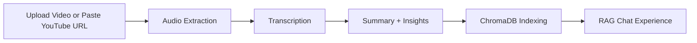

<div align="center">
  
# OmniVision
### See Beyond the Video

AI-powered video understanding that turns long-form content into searchable knowledge with transcription, summarization, and conversational RAG.


</div>

---

## Overview

OmniVision transforms videos into structured, searchable intelligence.

Upload a local video or paste a YouTube link, choose the transcription mode, and OmniVision will:

- transcribe the video
- generate a title and summary
- extract action items, key decisions, and open questions
- index the transcript in ChromaDB
- let you ask follow-up questions through a RAG assistant

This project combines a Flask backend, a React + Tailwind frontend, Whisper-based transcription, Sarvam Hindi-to-English transcription support, and LangChain-powered summarization and retrieval.

---

## Demo Flow



---

## Features

### Core Capabilities

- Video upload or YouTube link analysis
- English transcription with Whisper `small`
- Hindi-to-English transcription with Sarvam `saaras:v2.5`
- AI-generated title and meeting-style summary
- Extracted action items, key decisions, and open questions
- ChromaDB-based retrieval pipeline for follow-up questions
- Modern light-themed UI with animated processing states

### Frontend Experience

- Custom React + Tailwind interface
- Creative glassmorphism-inspired layout
- Interactive processing section
- Transcript, summary, and insight cards
- Conversational RAG assistant
- Markdown-rendered output formatting

---

## Tech Stack

| Layer | Tools |
|---|---|
| Frontend | React, Vite, Tailwind CSS, Lucide Icons |
| Backend | Flask |
| Transcription | OpenAI Whisper, Sarvam AI |
| LLM / Orchestration | LangChain, Mistral |
| Vector Store | ChromaDB |
| Media Processing | `yt-dlp`, `pydub`, `ffmpeg` |

---

## Project Structure

```text
AI Video assistant/
├─ app.py
├─ main.py
├─ run_backend.py
├─ requirements.txt
├─ .env.example
├─ README.md
├─ core/
│  ├─ extractor.py
│  ├─ pipeline.py
│  ├─ rag_engine.py
│  ├─ summarizer.py
│  ├─ transcriber.py
│  └─ vector_store.py
├─ utils/
│  └─ audio_processor.py
└─ frontend/
   ├─ index.html
   ├─ package.json
   ├─ package-lock.json
   ├─ vite.config.js
   ├─ tailwind.config.js
   ├─ postcss.config.js
   └─ src/
      ├─ App.jsx
      ├─ main.jsx
      └─ styles.css
```

---

## Quick Start

### 1. Clone the repository

```bash
git clone https://github.com/your-username/your-repo-name.git
cd your-repo-name
```

### 2. Create and activate a virtual environment

#### Windows PowerShell

```powershell
py -3.12 -m venv .venv
.venv\Scripts\Activate.ps1
```

#### macOS / Linux

```bash
python3 -m venv .venv
source .venv/bin/activate
```

### 3. Install backend dependencies

```bash
pip install -r requirements.txt
```

### 4. Configure environment variables

Copy `.env.example` to `.env` and fill in your keys:

```bash
cp .env.example .env
```

Required values:

- `MISTRAL_API_KEY`
- `SARVAM_API_KEY`

Optional:

- `WHISPER_MODEL`
- `SARVAM_STT_MODEL`

### 5. Install frontend dependencies

```bash
cd frontend
npm install
cd ..
```

### 6. Run the backend

```bash
python run_backend.py
```

Backend runs at:

`http://127.0.0.1:5000`

### 7. Run the frontend

In a second terminal:

```bash
cd frontend
npm run dev
```

Frontend runs at:

`http://127.0.0.1:5173`

---

## Environment Variables

```env
MISTRAL_API_KEY="your_mistral_api_key_here"
WHISPER_MODEL="small"
SARVAM_API_KEY="your_sarvam_api_key_here"
SARVAM_STT_MODEL="saaras:v2.5"
```

> Never commit your real `.env` file to GitHub.

---

## How It Works

<details>
<summary><strong>Pipeline Breakdown</strong></summary>

### Input Processing

- If the source is a YouTube URL, the app downloads audio using `yt-dlp`
- If the source is a local file, the app converts it to WAV
- Audio is chunked for manageable transcription

### Transcription

- `english` mode uses local Whisper
- `hinglish` mode uses Sarvam to transcribe Hindi audio into English text

### Post Processing

- Mistral generates:
  - a short title
  - a summary
  - action items
  - key decisions
  - open questions

### Retrieval

- The transcript is chunked and embedded
- ChromaDB stores transcript vectors
- LangChain retrieves relevant transcript segments for Q&A

</details>

---

## Screens and UX

<details>
<summary><strong>UI Highlights</strong></summary>

- Hero section with branded OmniVision positioning
- Upload + YouTube dual input flow
- Language selection for English or Hindi-to-English
- Animated processing card
- Summary and transcript views
- Insight cards for extracted outputs
- RAG assistant chat interface

</details>

---

## Common Commands

### Run backend

```bash
python run_backend.py
```

### Run frontend

```bash
cd frontend
npm run dev
```

### Build frontend

```bash
cd frontend
npm run build
```

---

## Deployment Notes

This project can be deployed, but there are a few practical considerations:

- Whisper can be heavy on small/free instances
- `ffmpeg` must be available on the server
- `yt-dlp` and long video processing may increase runtime significantly
- Chroma persistence should be configured carefully in production

Recommended first deployment targets:

- Render
- Railway
- VPS-based deployment for more control

---

## Manual GitHub Upload Checklist

Upload these:

- `app.py`
- `main.py`
- `run_backend.py`
- `requirements.txt`
- `.env.example`
- `README.md`
- `core/`
- `utils/`
- `frontend/`

Do not upload these:

- `.venv/`
- `frontend/node_modules/`
- `frontend/dist/`
- `.env`
- `vector_db/`
- `downloads/uploads/`
- logs and cache files

---

## Troubleshooting

<details>
<summary><strong>Frontend starts but backend does not respond</strong></summary>

Make sure the backend is running with:

```bash
python run_backend.py
```

</details>

<details>
<summary><strong>PowerShell blocks virtual environment activation</strong></summary>

Run:

```powershell
Set-ExecutionPolicy -Scope Process Bypass
```

Then activate again:

```powershell
.venv\Scripts\Activate.ps1
```

</details>

<details>
<summary><strong>YouTube processing takes a long time</strong></summary>

That is expected for long videos. The pipeline currently performs:

- download
- audio extraction
- transcription
- summarization
- vector indexing

Try a shorter clip first when testing.

</details>

---

## Security Notes

- Rotate any API keys that were ever exposed accidentally
- Keep `.env` private
- Do not commit vector databases, logs, or uploaded media

---

## Roadmap

- Background jobs for long-running video analysis
- Live progress tracking in the UI
- Better production deployment flow
- Transcript export options
- Multi-session history

---

## License

Add your preferred license here, for example `MIT`.

---

## Author

Built as an AI-powered video intelligence platform for turning content into actionable knowledge.

