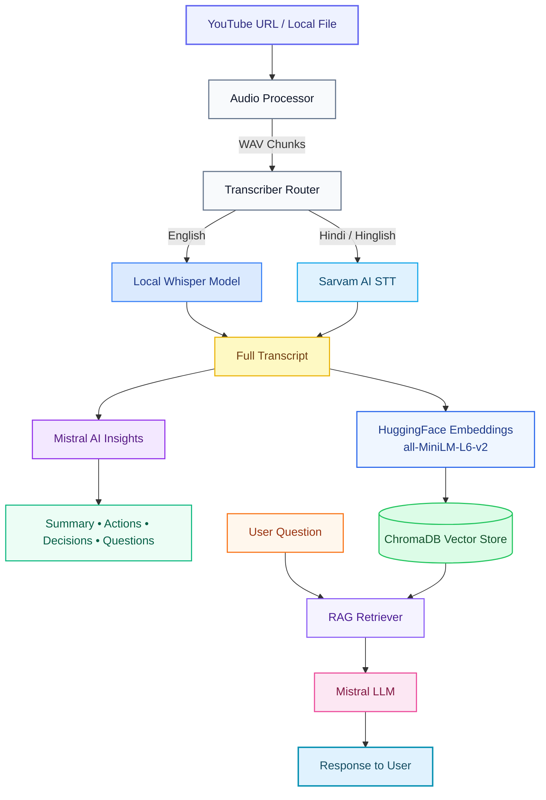

<!-- PROJECT TITLE & SUBTITLE -->
<h1 align="center">🔮 OmniVision</h1>
<p align="center">
  <strong>Transform video and audio sources into search-optimized, structured knowledge bases using a state-of-the-art local RAG engine.</strong>
</p>

<!-- BADGES -->
<p align="center">
  <a href="https://github.com/ranjeet22/OmniVision/stargazers"></a>
  <a href="https://github.com/ranjeet22/OmniVision/network/members"></a>
  <a href="https://github.com/ranjeet22/OmniVision/issues"></a>
  <a href="https://github.com/ranjeet22/OmniVision/blob/main/LICENSE"></a>
</p>

<p align="center">
  
  
  
  
  
  
  
  
</p>

<!-- PROJECT BANNER -->
<p align="center">
  
</p>

<hr />


## 🚀 Welcome to OmniVision
**OmniVision** is a powerful AI Video and Audio Assistant that processes media inputs (YouTube URLs or local file uploads) to extract structured, actionable summaries and compile a searchable knowledge base.

It handles multi-modal pipeline routing:
1. **Audio Extraction**: Parses inputs via `yt-dlp` and `ffmpeg` into high-quality audio chunks.
2. **Dual STT Engine**: Directs English audio to a local **OpenAI Whisper** model and Hinglish (mixed Hindi-English) audio to the **Sarvam AI** speech translation API.
3. **Structured Insights**: Runs summaries and extracts action items, key decisions, and open questions using **Mistral AI**.
4. **Vector database (RAG)**: Spins up a localized **ChromaDB** workspace using **HuggingFace Embeddings** to power interactive, context-grounded Q&A sessions.

---

## ⚡ Interactive Quick Demo

<details>
<summary><b>🖥️ Web UI Dashboard Preview</b></summary>

Our premium, glassmorphic Web UI (powered by Vite, React, and Tailwind CSS) provides an intuitive workspace:

- **Input Control Center**: Toggle between uploading files directly or pasting public YouTube URLs.
- **Language Switcher**: Simple toggle between English (processed entirely locally) and Hinglish.
- **Real-Time Step Progress Tracker**: Watch visual steps light up sequentially:
  ```
  [✓] Audio Extracted ──> [✓] Transcribed ──> [✓] Indexed in Chroma DB ──> [✓] Insights Ready
  ```
- **Interactive Insights Tabs**: Browse generated titles, summaries, action items, key decisions, and open questions in dedicated layouts.
- **RAG Chat Window**: Chat with the video and get precise responses based only on the parsed context.

</details>

<details>
<summary><b>💻 CLI Interactive Session Preview</b></summary>

Here is an example session running via the command line interface:

```bash
$ python main.py
starting AI Video Assistant
Enter YouTube URL or local file path: https://www.youtube.com/watch?v=dQw4w9WgXcQ
Language (english/hinglish): english
Using Whisper for transcription.
Loading Whisper model: small ...
Whisper model loaded.
Transcribing chunk 1/1...
Transcription complete.

============================================================
📌 Title: Rick Astley - Never Gonna Give You Up (Official Music Video)

📋 Summary:
* The content details a firm commitment toward emotional stability and partnership loyalty.
* The speaker makes several binding declarations: never leaving, never letting the other down, and avoiding lies that cause pain.

✅ Action Items:
* Build long-term, supportive connections.

🔑 Key Decisions:
* Standardized support policy will remain active indefinitely.

❓ Open Questions:
* Who is the specific target audience for these promises?
============================================================

💬 Chat with your meeting (type 'exit' to quit)

You: what is the speaker's main promise?

🤖 Assistant: The speaker's main promise is that they will never give you up, never let you down, never run around and desert you, never make you cry, never say goodbye, and never tell a lie and hurt you.

You: exit
👋 Goodbye!
```

</details>

---

## 🔑 Key Features
* 🎙️ **Multi-Engine Speech Processing**: Local **Whisper** model for English or **Sarvam AI STT** translation API for code-mixed Indian languages (Hinglish).
* 📝 **Insight Extraction**: Automated identification of action items, decisions, and unanswered questions via Mistral's `mistral-small-latest`.
* 🔍 **Smart Retrieval-Augmented Generation (RAG)**: Integrates LangChain's LCEL pipeline with `sentence-transformers` for embedding and Chroma for similarity retrieval.
* ⚡ **Hybrid Interface**: A responsive modern React web dashboard and a minimal, fast interactive CLI wrapper.
* 📦 **Robust Segment Management**: Splitting pipelines slice audio into optimized, safe sizes (5-minute chunks for local Whisper, 25-second pieces for Sarvam API) preventing timeout failures.

---

## 🧬 System Architecture

The following diagram illustrates how media files flow through OmniVision to compile searchable knowledge:



---

## 🛠️ Quick Start

<details>
<summary><b>1. System Requirements & FFmpeg Setup</b></summary>

Ensure you have **Python 3.10+** and **Node.js** installed on your system. 

Additionally, **FFmpeg** must be installed and added to your system's PATH variables to allow audio extraction:

* **Windows**: Run `winget install Gyan.FFmpeg` in PowerShell as administrator.
* **macOS**: Run `brew install ffmpeg` via Homebrew.
* **Linux**: Run `sudo apt update && sudo apt install ffmpeg` for Debian/Ubuntu systems.

</details>

<details>
<summary><b>2. Set Up Environment Variables</b></summary>

Create a file named `.env` in the project root:

```env
# Required: Mistral API key for summaries and RAG chat
MISTRAL_API_KEY=your_mistral_api_key_here

# Optional: Required if using Hinglish transcription translation
SARVAM_API_KEY=your_sarvam_api_key_here

# Optional: Whisper model size (tiny, base, small, medium, large)
WHISPER_MODEL=small
```

</details>

<details>
<summary><b>3. Backend Installation</b></summary>

1. Clone the repository:
   ```bash
   git clone https://github.com/ranjeet22/OmniVision.git
   cd OmniVision
   ```
2. Set up a Python virtual environment:
   ```bash
   python -m venv .venv
   ```
3. Activate the virtual environment:
   * **Windows (PowerShell):** `.venv\Scripts\Activate.ps1`
   * **macOS/Linux:** `source .venv/bin/activate`
4. Install python dependencies:
   ```bash
   pip install -r requirements.txt
   ```

</details>

<details>
<summary><b>4. Frontend Setup</b></summary>

1. Navigate to the frontend workspace:
   ```bash
   cd frontend
   ```
2. Install npm packages:
   ```bash
   npm install
   ```
3. Build the assets for production deployment:
   ```bash
   npm run build
   ```
4. Navigate back to the root:
   ```bash
   cd ..
   ```

</details>

<details>
<summary><b>5. Running the Application</b></summary>

### Run Web UI Dashboard
Launch the Flask backend server:
```bash
python app.py
```
Open your web browser and go to **[http://localhost:5000](http://localhost:5000)**.

### Run Interactive CLI Tool
Start the terminal interface:
```bash
python main.py
```

</details>

---

## 🔌 API Endpoints

OmniVision runs a clean JSON REST API backend:

| Method | Endpoint | Description |
| :--- | :--- | :--- |
| `GET` | `/api/health` | Service health status |
| `POST` | `/api/analyze` | Transcribe and extract insights |
| `POST` | `/api/ask` | Chat with processed transcript using RAG |

<details>
<summary><b>Detail Specs of API Endpoints</b></summary>

### `POST /api/analyze`
* **Form-Data Request Body:**
  * `sourceType`: `"youtube"` or `"upload"`
  * `youtubeUrl`: YouTube URL (if sourceType is `youtube`)
  * `file`: Binary file stream (if sourceType is `upload`)
  * `language`: `"english"` or `"hinglish"`
* **Response Payload (`200 OK`):**
  ```json
  {
    "sessionId": "UUID-hex-string",
    "title": "Generated Meeting Title",
    "transcript": "Full text transcription...",
    "summary": "Formatted Markdown Summary",
    "actionItems": "Formatted Markdown Action Items",
    "keyDecisions": "Formatted Markdown Key Decisions",
    "openQuestions": "Formatted Markdown Open Questions",
    "metadata": {
      "chunksProcessed": 3,
      "language": "english",
      "source": "https://..."
    }
  }
  ```

### `POST /api/ask`
* **JSON Request Body:**
  ```json
  {
    "sessionId": "UUID-hex-string",
    "question": "What did they decide about the API integration?"
  }
  ```
* **Response Payload (`200 OK`):**
  ```json
  {
    "answer": "The API integration will be implemented using LangChain and Mistral AI..."
  }
  ```

</details>

---

## 🤝 Contributing
Contributions are what make the open-source community an amazing place to learn, inspire, and create. Any contribution you make is **greatly appreciated**.

1. **Fork** the Project
2. Create your Feature Branch (`git checkout -b feature/AmazingFeature`)
3. **Commit** your Changes (`git commit -m 'Add some AmazingFeature'`)
4. **Push** to the Branch (`git push origin feature/AmazingFeature`)
5. Open a **Pull Request**

---

## 📄 License
This project is licensed under the MIT License. See the [LICENSE](LICENSE) file for details.

<hr />
<p align="center">
  Crafted by <a href="https://www.linkedin.com/in/ranjeet-singh-a08961305/">Ranjeet</a>
</p>
